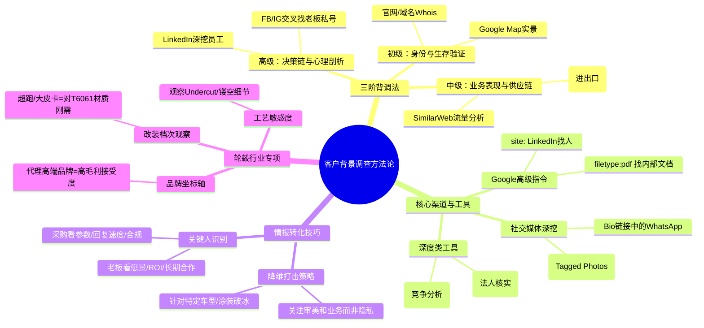

# 外贸客户背景调查方法论思维导图

```mermaid
mindmap
  root((客户背景调查方法论))
    三阶背调法
      初级：身份与生存验证
        官网/域名Whois
        Google Map实景
      中级：业务表现与供应链
        海关数据(进出口)
        SimilarWeb流量分析
      高级：决策链与心理剖析
        LinkedIn深挖员工
        FB/IG交叉找老板私号
    核心渠道与工具
      Google高级指令
        site: LinkedIn找人
        filetype:pdf 找内部文档
      社交媒体深挖
        被标记的照片(Tagged Photos)
        Bio链接中的WhatsApp
      深度类工具
        SimilarWeb(竞争分析)
        各国工商公示网(法人核实)
    情报转化技巧
      降维打击策略
        关注审美和业务而非隐私
        针对特定车型/涂装破冰
      关键人识别
        老板看愿景/ROI/长期合作
        采购看参数/回复速度/合规
    轮毂行业专项
      品牌坐标轴
        代理高端品牌=高毛利接受度
      改装档次观察
        超跑/大皮卡=对T6061材质刚需
      工艺敏感度
        观察Undercut/镂空细节
```
