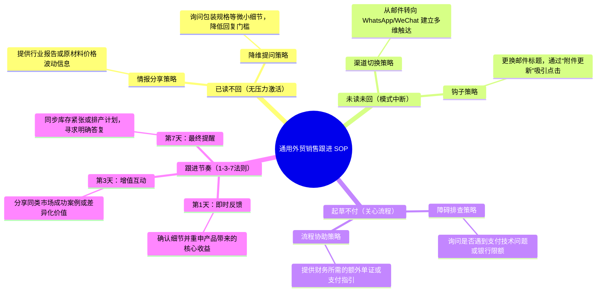

# 通用外贸销售跟进 SOP 思维导图

```mermaid
mindmap
  root((通用外贸销售跟进 SOP))
    已读不回（无压力激活）
      情报分享策略
        提供行业报告或原材料价格波动信息
      降维提问策略
        询问包装规格等微小细节，降低回复门槛
    未读未回（模式中断）
      渠道切换策略
        从邮件转向 WhatsApp/WeChat 建立多维触达
      钩子策略
        更换邮件标题，通过“附件更新”吸引点击
    起草不付（关心流程）
      障碍排查策略
        询问是否遇到支付技术问题或银行限额
      流程协助策略
        提供财务所需的额外单证或支付指引
    跟进节奏（1-3-7法则）
      第1天：即时反馈
        确认细节并重申产品带来的核心收益
      第3天：增值互动
        分享同类市场成功案例或差异化价值
      第7天：最终提醒
        同步库存紧张或排产计划，寻求明确答复
```
